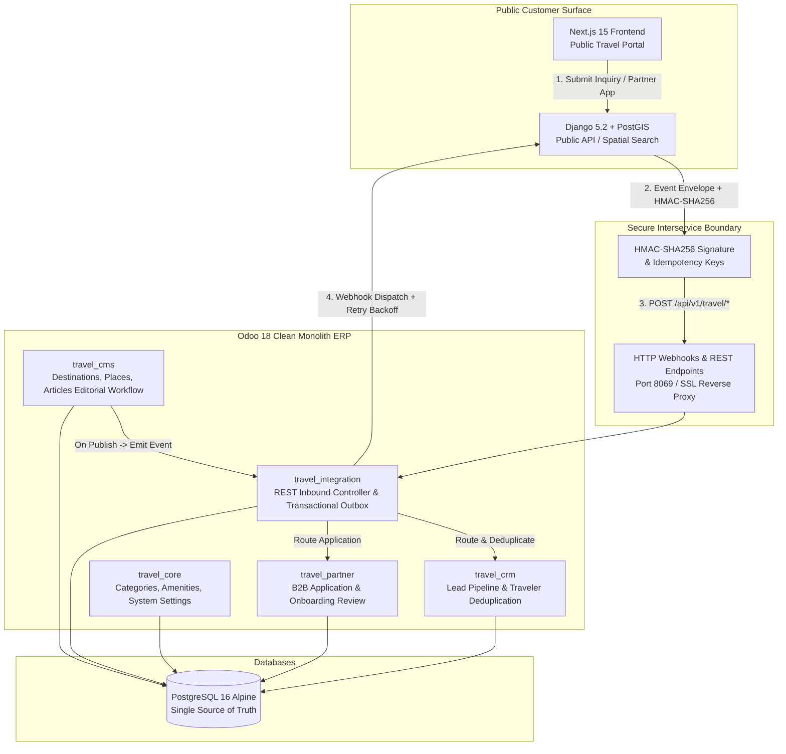

# Star Travels ERP — Odoo 18 Clean Monolith

[](https://www.odoo.com/)
[](https://www.python.org/)
[](https://www.postgresql.org/)
[](https://www.docker.com/)
[](#kiểm-thử-toàn-diện-testing-suite)
[](https://github.com/astral-sh/ruff)
[](#kiến-trúc-hệ-thống)

Hệ thống ERP Quản trị Bán lẻ & Vận hành Du lịch Đa kênh (Omnichannel Travel Operations & Retail ERP) xây dựng trên nền tảng **Odoo 18 Clean Monolith**. Hệ thống đóng vai trò là **Single Source of Truth** tuyệt đối cho Quản lý nội dung (CMS Authoring), Quản lý quan hệ khách hàng (CRM Pipelines & Lead Ingestion), Quy trình thẩm định đối tác B2B (Partner Verification), và Điều phối sự kiện giao dịch (Transactional Outbox).

---

## Mục Lục
- [1. Kiến Trúc Hệ Thống](#1-kiến-trúc-hệ-thống)
- [2. Cấu Trúc Codebase & Module](#2-cấu-trúc-codebase--module)
- [3. Tính Năng Nổi Bật](#3-tính-năng-nổi-bật)
- [4. Khởi Chạy Nhanh (Quick Start)](#4-khởi-chạy-nhanh-quick-start)
- [5. Kiểm Thử Toàn Diện (Testing Suite)](#5-kiểm-thử-toàn-diện-testing-suite)
- [6. Hợp Đồng Dữ Liệu & API Contracts](#6-hợp-đồng-dữ-liệu--api-contracts)
- [7. Tiêu Chuẩn Kỹ Thuật (Engineering Standards)](#7-tiêu-chuẩn-kỹ-thuật-engineering-standards)

---

## 1. Kiến Trúc Hệ Thống

Dự án tách biệt rành mạch giữa **Mô hình Phục vụ Công cộng (Public Serving Model)** và **Mô hình Quản trị Tác nghiệp (Operational Backoffice)** để đảm bảo hiệu năng cao, cách ly rủi ro và không tranh chấp tài nguyên database:



---

## 2. Cấu Trúc Codebase & Module

Codebase tuân thủ nghiêm ngặt quy tắc module hóa `odoo scaffold`, không có code thừa và phân tách trách nhiệm rõ ràng:

```text
ERP/
├── .agents/                    # Bộ 18 Kỹ năng Senior Engineering & AGENTS.md
├── config/                     # Cấu hình hạ tầng
│   ├── nginx/nginx.conf        # Nginx Reverse Proxy & SSL Gateway
│   └── odoo.conf               # Cấu hình Odoo 18 (addons_path, multi-worker)
├── contracts/                  # Data Contracts & Schemas
│   └── integration/            # JSON Schemas (inquiry, content_published, openapi.yaml)
├── docs/                       # Tài liệu kỹ thuật dự án
│   ├── adr/                    # Architecture Decision Records (ADR-001 -> ADR-003)
│   └── specs/                  # Đặc tả kỹ thuật và prompt tích hợp
├── odoo_addons/                # Các Modules Odoo 18 Clean Monolith
│   ├── travel_core/            # Danh mục, Tiện ích, Cấu hình Webhook
│   ├── travel_cms/             # CMS Du lịch: Destination, Place, Article (State Machine)
│   ├── travel_crm/             # CRM Leads, Nguồn giới thiệu UTM, Deduplication
│   ├── travel_partner/         # Hồ sơ đăng ký Đối tác B2B, Thẩm định hồ sơ
│   ├── travel_integration/     # Controller REST, Chữ ký HMAC, Outbox, Idempotency Cache
│   └── muk_web_*/              # Bộ theme giao diện cao cấp cho Odoo 18
├── scripts/                    # Scripts tiện ích & Seeding dữ liệu
│   ├── seed_odoo_cms.py        # Nạp dữ liệu mẫu Điểm đến/Địa điểm/Bài viết vào Odoo
│   └── README.md               # Hướng dẫn chi tiết từng script
├── tests/                      # Bộ kiểm thử E2E Live Integration (Pytest)
│   ├── conftest.py             # Fixtures, XML-RPC Client, Odoo Session setup
│   ├── test_e2e_api_contracts.py  # Kiểm thử Inbound REST APIs, HMAC, Idempotency
│   └── test_e2e_cms_workflow.py   # Kiểm thử Vòng đời CMS, Outbox, Đối tác B2B
├── docker-compose.yml          # Docker Compose định nghĩa Odoo 18 & Postgres 16
├── pyproject.toml              # Cấu hình công cụ Linter (Ruff) và Static Analysis
└── pytest.ini                  # Cấu hình môi trường Pytest
```

---

## 3. Tính Năng Nổi Bật

### 3.1 Phòng Thủ Idempotency & Replay Attack Tuyệt Đối
- Mọi request Inbound bắt buộc mang header `X-Idempotency-Key` (hoặc `event_id` trong payload).
- Bảng `travel.integration.event` lưu trữ lịch sử xử lý với ràng buộc duy nhất `unique(source, external_event_id)`.
- Khi nhận request trùng lặp (do network retry từ Public Platform), Odoo trả về trực tiếp response đã cache từ DB, tăng `attempt_count`, **tuyệt đối không tạo trùng Lead hay Đối tác**.

### 3.2 Quy Trình Biên Tập CMS (State Machine & Versioning)
- Các thực thể `travel.destination`, `travel.place`, `travel.article` vận hành theo luồng kiểm duyệt 4 bước:  
  `Draft (Bản nháp)` $\rightarrow$ `In Review (Chờ duyệt)` $\rightarrow$ `Approved (Đã duyệt)` $\rightarrow$ `Published (Xuất bản)`.
- Mỗi lần chuyển từ `draft` sang `published`, hệ thống tự động tăng trường `version` và cập nhật `published_at`.

### 3.3 Transactional Outbox Pattern
- Khi nội dung được xuất bản, bản ghi sự kiện `*.published` được tạo trực tiếp vào bảng `travel.integration.outbox` **trong cùng Database Transaction**.
- Scheduler định kỳ kích hoạt dispatcher, tự động ký HMAC-SHA256 và gửi webhook sang Public Platform với cơ chế Exponential Backoff retry (tối đa 5 lần).

### 3.4 Thẩm Định Đối Tác B2B
- Tiếp nhận đơn đăng ký đối tác qua API: `Submitted` $\rightarrow$ `Under Review` $\rightarrow$ `Approved` / `Rejected`.
- Khi phê duyệt, hệ thống tự động sinh tài khoản doanh nghiệp `res.partner` (`is_company=True`) và cấp `organization_slug`.

---

## 4. Khởi Chạy Nhanh (Quick Start)

### Yêu Cầu Tiên Quyết
- Docker & Docker Compose v2.x
- Python 3.12+ (cho việc chạy bộ E2E Test và Seed script từ máy trạm)

### Bước 1: Khởi động hệ thống qua Docker
```bash
docker compose up -d
```

### Bước 2: Truy cập Odoo Web Portal
- **Địa chỉ**: [http://localhost:8069](http://localhost:8069)
- **Database**: `odoo_travel`
- **Tài khoản**: `admin`
- **Mật khẩu**: `admin`

### Bước 3: Nạp dữ liệu hạt giống (Seed Demo Vietnam Destinations)
```bash
python scripts/seed_odoo_cms.py
```

---

## 5. Kiểm Thử Toàn Diện (Testing Suite)

Dự án áp dụng mô hình kiểm thử kép (Dual-Engine Testing Strategy) với **30/30 Test Cases PASSED (100% Green)**:

```text
================================ TEST EXECUTION MATRIX ================================
1. Odoo Native Tests (Docker / In-Container / DB Rollback):
   - travel_core:         5/5 passed  [0.14s]
   - travel_cms:          5/5 passed  [0.26s]
   - travel_crm:          5/5 passed  [0.29s]
   - travel_partner:      4/4 passed  [0.18s]
   - travel_integration: 14/14 passed [1.21s]
   --------------------------------------------------------
   Subtotal:             21/21 passed (0 failed, 0 error)

2. Host Live E2E Integration Tests (Pytest / Live HTTP & XML-RPC):
   - test_e2e_api_contracts.py: 5/5 passed
   - test_e2e_cms_workflow.py:  4/4 passed
   --------------------------------------------------------
   Subtotal:              9/9 passed [2.44s]

TOTAL:                   30/30 TEST CASES PASSED (100% GREEN)
=======================================================================================
```

### Lệnh chạy Odoo Native Tests trong Docker
```bash
docker exec -i odoo18_app odoo -d odoo_travel --http-port 8070 \
  --test-enable \
  --test-tags /travel_core,/travel_cms,/travel_partner,/travel_crm,/travel_integration \
  --stop-after-init --log-level=test
```

### Lệnh chạy Pytest Live E2E Tests từ Host
```bash
python -m pytest tests -v
```

### Lệnh kiểm tra chất lượng mã nguồn (Linter & Types)
```bash
# Kiểm tra định dạng & linting bằng Ruff
python -m ruff check .

# Kiểm tra tĩnh Type Checking bằng Pyright
npx pyright
```

---

## 6. Hợp Đồng Dữ Liệu & API Contracts

Chi tiết OpenAPI specification được định nghĩa tại [contracts/integration/openapi.yaml](file:///d:/Joyce/My%20documents/Pjs/Pjs%20src/ERP/contracts/integration/openapi.yaml).

| Endpoint | Method | Xác thực | Mục đích |
| :--- | :---: | :--- | :--- |
| `/api/v1/travel/health` | `GET` | Public | Kiểm tra trạng thái hoạt động của ERP |
| `/api/v1/travel/inquiry` | `POST` | HMAC / API-Key | Tiếp nhận yêu cầu tư vấn tour / khách hàng mới |
| `/api/v1/travel/partner-application` | `POST` | HMAC / API-Key | Nộp hồ sơ đăng ký đối tác du lịch B2B |

### Cấu Trúc Lỗi Chuẩn RFC 7807 (Problem Details)
Mọi phản hồi lỗi `4xx` và `5xx` đều tuân thủ cấu trúc chuẩn:
```json
{
  "type": "https://api.star-travels.com/errors/unauthorized",
  "title": "Unauthorized",
  "status": 401,
  "detail": "Invalid or missing webhook signature (X-Signature-SHA256)"
}
```

---

## 7. Tiêu Chuẩn Kỹ Thuật (Engineering Standards)

- **Quy tắc phối hợp**: Tuân thủ nghiêm ngặt quy chuẩn 18 kỹ năng tại [AGENTS.md](file:///d:/Joyce/My%20documents/Pjs/Pjs%20src/ERP/AGENTS.md).
- **Tài liệu quyết định kiến trúc**: Tham khảo chi tiết tại [docs/adr/](file:///d:/Joyce/My%20documents/Pjs/Pjs%20src/ERP/docs/adr).
  - `ADR-001`: Khóa giữ tồn kho nguyên khối (Atomic Stock Reservation).
  - `ADR-002`: Kiến trúc Clean Monolith tích hợp Odoo 18 và Nền tảng Du lịch.
  - `ADR-003`: Mẫu Outbox giao dịch và cơ chế phòng thủ Idempotency Inbound.
- **Git Conventions**: Conventional Commits (`feat:`, `fix:`, `refactor:`, `test:`, `docs:`), chia nhỏ Atomic Commits, SemVer `18.0.x.x.x`.
